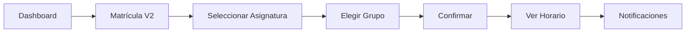
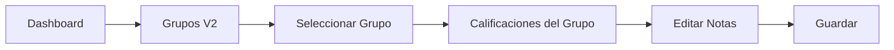
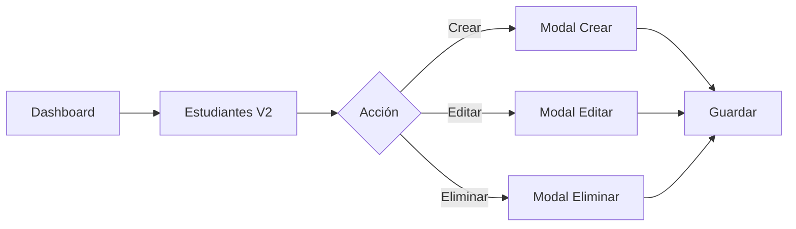

# 🗺️ Guía de Rutas y Navegación

## 📋 Resumen

Este documento detalla todas las rutas configuradas en `AppRoutes.jsx`, incluyendo las **7 nuevas páginas** integradas al sistema.

---

## 🔗 Rutas Públicas

| Ruta | Componente | Descripción |
|------|-----------|-------------|
| `/login` | `LoginPage` | Página de inicio de sesión |
| `/recuperar-password` | `RecoverPasswordPage` | Recuperación de contraseña |

---

## 👨‍🎓 Rutas de Estudiante

### Base: `/estudiante/*`

| Ruta Completa | Componente | Descripción | Estado |
|--------------|-----------|-------------|--------|
| `/estudiante/dashboard` | `DashboardEstudiante` | Panel principal | Existente |
| **Matrícula** |
| `/estudiante/matricula` | `MatriculaPage` | Matrícula original | Existente |
| `/estudiante/matricula-v2` | `MatriculaMejoradaPage` | ✨ **Matrícula mejorada** | **NUEVO** |
| `/estudiante/historial-matricula` | `HistorialMatriculaPage` | Historial de matrículas | Existente |
| **Calificaciones** |
| `/estudiante/notas` | `NotasPage` | Notas original | Existente |
| `/estudiante/notas-v2` | `NotasMejoradasPage` | ✨ **Notas mejoradas** | **NUEVO** |
| **Horario y Notificaciones** |
| `/estudiante/horario` | `HorarioPage` | ✨ **Horario semanal** | **NUEVO** |
| `/estudiante/notificaciones` | `NotificacionesPage` | ✨ **Centro de notificaciones** | **NUEVO** |
| **Otras** |
| `/estudiante/riesgo` | `RiesgoPage` | Análisis de riesgo académico | Existente |
| `/estudiante/perfil` | `PerfilPage` | Perfil del estudiante | Existente |

### 🎯 Páginas Principales del Estudiante

#### 1. Horario (`/estudiante/horario`)
```
Funcionalidades:
✅ Grilla semanal completa
✅ Descarga PDF
✅ Impresión optimizada
✅ Estadísticas de clases
```

#### 2. Notificaciones (`/estudiante/notificaciones`)
```
Funcionalidades:
✅ Filtros por tipo y prioridad
✅ Marcar como leída
✅ Alertas críticas destacadas
✅ Toggle leídas/no leídas
```

#### 3. Notas V2 (`/estudiante/notas-v2`)
```
Funcionalidades:
✅ Vista tabla/tarjetas
✅ Filtro por período
✅ Estadísticas completas
✅ Promedio automático
```

#### 4. Matrícula V2 (`/estudiante/matricula-v2`)
```
Funcionalidades:
✅ Agregar/retirar asignaturas
✅ Selección de grupos
✅ Validación de prerrequisitos
✅ Cálculo de costos
```

---

## 🎓 Rutas de Docente

### Base: `/docente/*`

| Ruta Completa | Componente | Descripción | Estado |
|--------------|-----------|-------------|--------|
| `/docente/dashboard` | `DashboardDocente` | Panel principal | Existente |
| **Grupos** |
| `/docente/grupos` | `GruposPage` | Grupos original | Existente |
| `/docente/grupos-v2` | `GruposDocentePage` | ✨ **Gestión de grupos mejorada** | **NUEVO** |
| `/docente/grupos/:codGrupo/calificaciones` | `CalificacionesGrupoPage` | ✨ **Calificaciones del grupo** | **NUEVO** |
| **Calificaciones** |
| `/docente/calificaciones` | `CalificacionesPage` | Calificaciones original | Existente |
| `/docente/calificaciones/:grupoId/registrar` | `RegistrarNotasPage` | Registrar notas | Existente |
| **Otras** |
| `/docente/examenes` | `ExamenesPage` | Gestión de exámenes | Existente |
| `/docente/reportes` | `ReportesDocente` | Reportes del docente | Existente |

### 🎯 Páginas Principales del Docente

#### 1. Grupos V2 (`/docente/grupos-v2`)
```
Funcionalidades:
✅ Listado con GrupoCard
✅ Filtros por período/asignatura
✅ Estadísticas de ocupación
✅ Click para ir a calificaciones
```

#### 2. Calificaciones del Grupo (`/docente/grupos/:codGrupo/calificaciones`)
```
Funcionalidades:
✅ Tabla editable
✅ Guardado batch
✅ Exportación a Excel
✅ Estadísticas del grupo

Ejemplo de URL:
/docente/grupos/GRP001/calificaciones
```

---

## 👤 Rutas de Administrador

### Base: `/administrador/*`

| Ruta Completa | Componente | Descripción | Estado |
|--------------|-----------|-------------|--------|
| `/administrador/dashboard` | `DashboardAdmin` | Panel principal | Existente |
| **Gestión Académica** |
| `/administrador/programas` | `ProgramasPage` | Programas académicos | Existente |
| `/administrador/asignaturas` | `AsignaturasPage` | Asignaturas | Existente |
| `/administrador/periodos` | `PeriodosPage` | Períodos académicos | Existente |
| **Gestión de Usuarios** |
| `/administrador/docentes` | `DocentesPage` | Docentes original | Existente |
| `/administrador/estudiantes` | `EstudiantesPage` | Estudiantes original | Existente |
| `/administrador/estudiantes-v2` | `EstudiantesAdminPage` | ✨ **Gestión de estudiantes mejorada** | **NUEVO** |
| **Grupos** |
| `/administrador/grupos` | `GruposPageAdmin` | Listado de grupos | Existente |
| `/administrador/grupos/crear` | `CrearGrupoPage` | Crear nuevo grupo | Existente |
| `/administrador/grupos/:grupoId/estudiantes` | `AsignarEstudiantesPage` | Asignar estudiantes | Existente |
| **Otras** |
| `/administrador/sedes` | `SedesPage` | Gestión de sedes | Existente |
| `/administrador/reportes` | `ReportesPage` | Reportes del sistema | Existente |
| `/administrador/configuracion` | `ConfiguracionPage` | Configuración general | Existente |
| `/administrador/logs` | `LogsPage` | Registros del sistema | Existente |

### 🎯 Página Principal del Administrador

#### 1. Estudiantes V2 (`/administrador/estudiantes-v2`)
```
Funcionalidades:
✅ CRUD completo
✅ Búsqueda y filtros
✅ Paginación
✅ 3 modales (crear/editar/eliminar)
✅ Exportación
```

---

## 🔐 Rutas de Otros Roles

### Coordinador Académico
**Base:** `/coordinador/*`

| Ruta | Componente |
|------|-----------|
| `/coordinador/dashboard` | `DashboardCoordinador` |

### Registro Académico
**Base:** `/registro/*`

| Ruta | Componente |
|------|-----------|
| `/registro/dashboard` | `DashboardRegistro` |

### Analista
**Base:** `/analista/*`

| Ruta | Componente |
|------|-----------|
| `/analista/dashboard` | `DashboardAnalista` |

---

## 🌐 Rutas Compartidas

| Ruta | Componente | Descripción |
|------|-----------|-------------|
| `/reportes/detalle` | `ReporteDetallePage` | Detalle de reportes (todos los roles) |

---

## 📊 Estadísticas de Rutas

| Categoría | Cantidad |
|-----------|----------|
| **Total de rutas** | 47+ |
| **Rutas de Estudiante** | 10 |
| **Rutas de Docente** | 8 |
| **Rutas de Administrador** | 16 |
| **Rutas Públicas** | 2 |
| **Rutas Compartidas** | 1 |
| **Nuevas páginas integradas** | 7 |

---

## 🚀 Versiones Mejoradas vs Originales

| Funcionalidad | Ruta Original | Ruta Mejorada (V2) |
|--------------|---------------|-------------------|
| **Matrícula** | `/estudiante/matricula` | `/estudiante/matricula-v2` |
| **Notas** | `/estudiante/notas` | `/estudiante/notas-v2` |
| **Grupos (Docente)** | `/docente/grupos` | `/docente/grupos-v2` |
| **Estudiantes (Admin)** | `/administrador/estudiantes` | `/administrador/estudiantes-v2` |

### ¿Por qué mantener ambas versiones?

✅ **Migración gradual** - Permite probar la nueva versión sin romper la existente  
✅ **Comparación A/B** - Los usuarios pueden comparar funcionalidades  
✅ **Rollback seguro** - Si hay problemas, se puede volver a la versión original  
✅ **Feedback** - Recopilar opiniones antes de migración completa

---

## 🔄 Flujos de Navegación

### Flujo: Estudiante - Proceso de Matrícula



**URLs:**
1. `/estudiante/dashboard`
2. `/estudiante/matricula-v2`
3. `/estudiante/horario`
4. `/estudiante/notificaciones`

---

### Flujo: Docente - Gestión de Calificaciones



**URLs:**
1. `/docente/dashboard`
2. `/docente/grupos-v2`
3. `/docente/grupos/:codGrupo/calificaciones`

---

### Flujo: Administrador - Gestión de Estudiantes



**URLs:**
1. `/administrador/dashboard`
2. `/administrador/estudiantes-v2`

---

## 🛡️ Protección de Rutas

Todas las rutas están protegidas por:

1. **PrivateRoute** - Requiere autenticación
2. **RoleGuard** - Verifica roles autorizados

### Ejemplo de Configuración:

```jsx
<Route
  path="/estudiante/*"
  element={
    <PrivateRoute>
      <RoleGuard roles={["estudiante"]}>
        <Routes>
          <Route path="horario" element={<HorarioPage />} />
        </Routes>
      </RoleGuard>
    </PrivateRoute>
  }
/>
```

---

## 📝 Navegación Programática

### Desde Componentes

```jsx
import { useNavigate } from 'react-router-dom';

const navigate = useNavigate();

// Ir a horario
navigate('/estudiante/horario');

// Ir a calificaciones de un grupo
navigate(`/docente/grupos/${codGrupo}/calificaciones`);

// Volver atrás
navigate(-1);
```

### Redirecciones Automáticas

- **Root (`/`)** → `/login`
- **Ruta no encontrada** → `/login`
- **Ruta de rol sin especificar** → `dashboard` del rol

---

## 🔍 Testing de Rutas

### URLs de Prueba

```bash
# Estudiante
http://localhost:5173/estudiante/horario
http://localhost:5173/estudiante/notificaciones
http://localhost:5173/estudiante/notas-v2
http://localhost:5173/estudiante/matricula-v2

# Docente
http://localhost:5173/docente/grupos-v2
http://localhost:5173/docente/grupos/GRP001/calificaciones

# Administrador
http://localhost:5173/administrador/estudiantes-v2
```

---

## ✅ Checklist de Integración

- [x] Importar todas las páginas nuevas
- [x] Agregar rutas de Estudiante
- [x] Agregar rutas de Docente
- [x] Agregar rutas de Administrador
- [x] Mantener versiones originales (V1)
- [x] Agregar comentarios organizativos
- [x] Verificar sin errores de compilación
- [ ] Actualizar Sidebar con nuevas rutas
- [ ] Actualizar Navbar con enlaces
- [ ] Documentar en manual de usuario
- [ ] Testing de navegación completa

---

## 🎨 Próximos Pasos

1. **Actualizar Sidebar** - Agregar enlaces a las nuevas páginas
2. **Actualizar Navbar** - Incluir notificaciones badge
3. **Breadcrumbs** - Implementar navegación de migas de pan
4. **Guards adicionales** - Validar acceso a grupos específicos
5. **Analytics** - Rastrear navegación de usuarios

---

**Última actualización:** 17 de noviembre de 2025  
**Total de páginas integradas:** 7 nuevas páginas  
**Estado:** ✅ Listo para uso
